# LTP Architecture (v2 — Option C Security)

## Table of Contents

- [System Overview](#system-overview)
- [Component Architecture](#component-architecture)
  - [Entity Engine](#1-entity-engine)
  - [Lattice Key Generator](#2-lattice-key-generator-v2--minimal-sealed-key)
  - [Materialization Engine](#3-materialization-engine-v2--unseal-derive-decrypt)
- [Commitment Network Topology](#4-commitment-network-topology)
  - [Node Lifecycle](#41-node-lifecycle)
  - [Audit Protocol](#42-audit-protocol)
- [Transfer Flow](#5-transfer-flow-sequence)
- [Security Layers](#6-security-layers)
- [Data Flow Summary](#7-data-flow-summary)
- [Technology Choices](#8-technology-choices)
- [Economics Engine](#9-economics-engine)
- [Enforcement Pipeline](#10-enforcement-pipeline)
- [Progressive Decentralization](#11-progressive-decentralization)
- [Compliance Framework](#12-compliance-framework)
- [Federation Protocol](#13-federation-protocol)
- [Streaming Protocol](#14-streaming-protocol)
- [ZK Transfer Mode](#15-zk-transfer-mode)
- [Bridge Protocol](#16-bridge-protocol)
- [Backend Architecture](#17-backend-architecture)

## System Overview

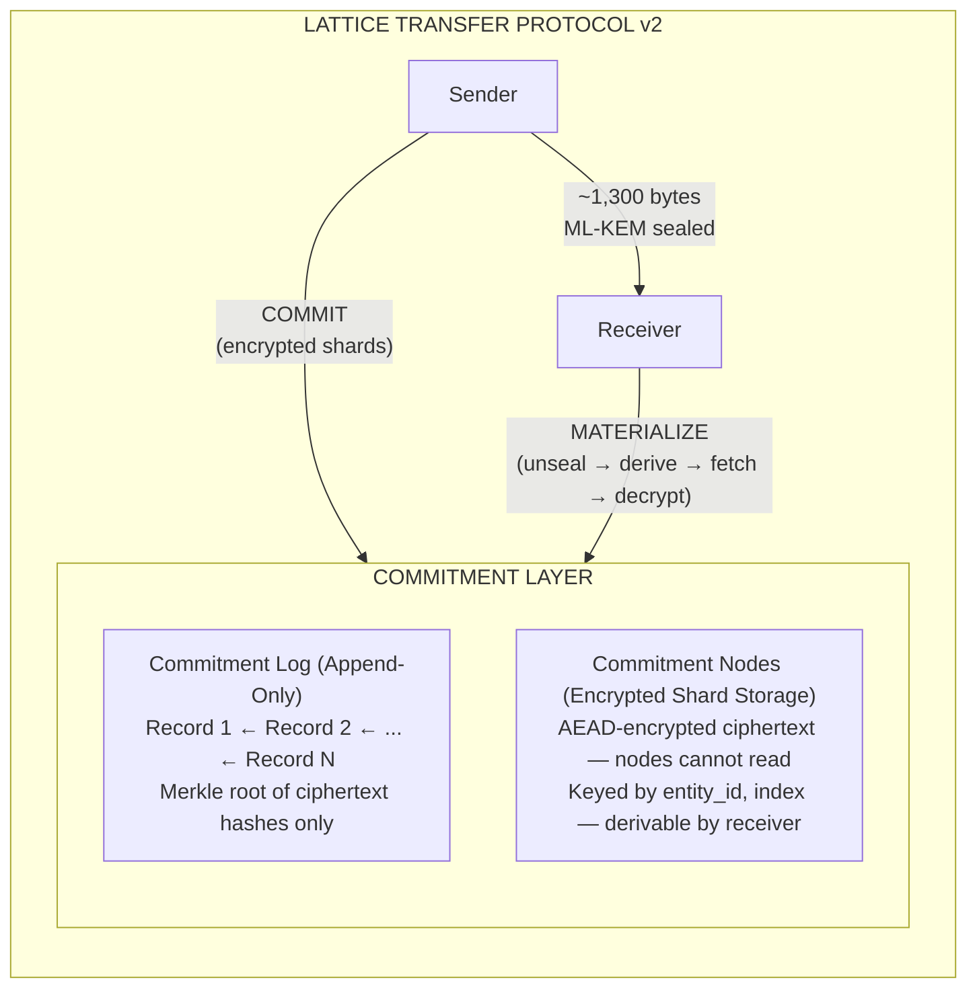

---

## Component Architecture

### 1. Entity Engine

The Entity Engine is the sender-side component that prepares entities for commitment.

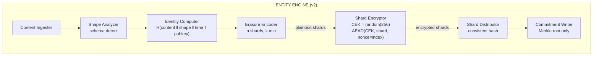

### 2. Lattice Key Generator (v2 — Minimal Sealed Key)

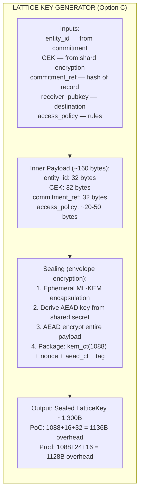

### 3. Materialization Engine (v2 — Unseal, Derive, Decrypt)

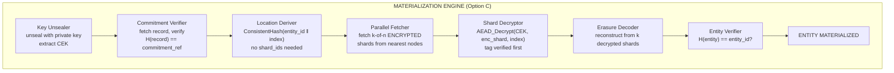

---

## 4. Commitment Network Topology

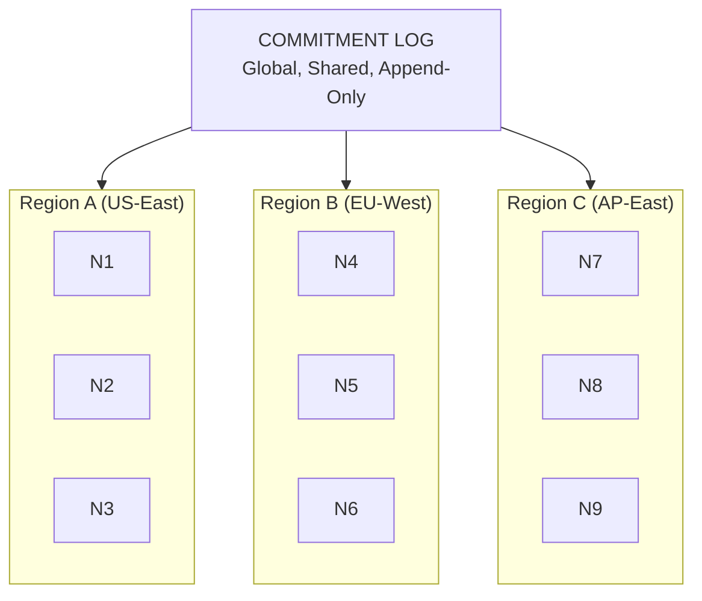

Commitment nodes store ENCRYPTED shards and replicate within and across regions.
Receivers fetch from nearest nodes. Nodes cannot read shard content (ciphertext only).

### 4.1 Node Lifecycle

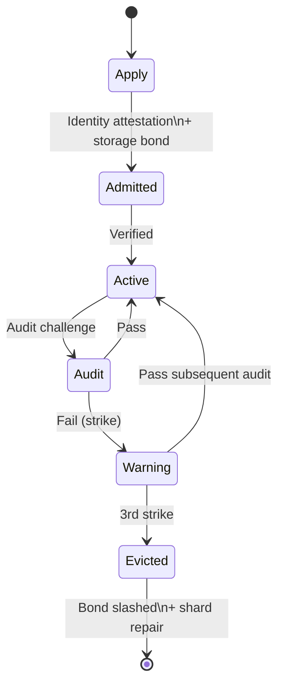

### 4.2 Audit Protocol

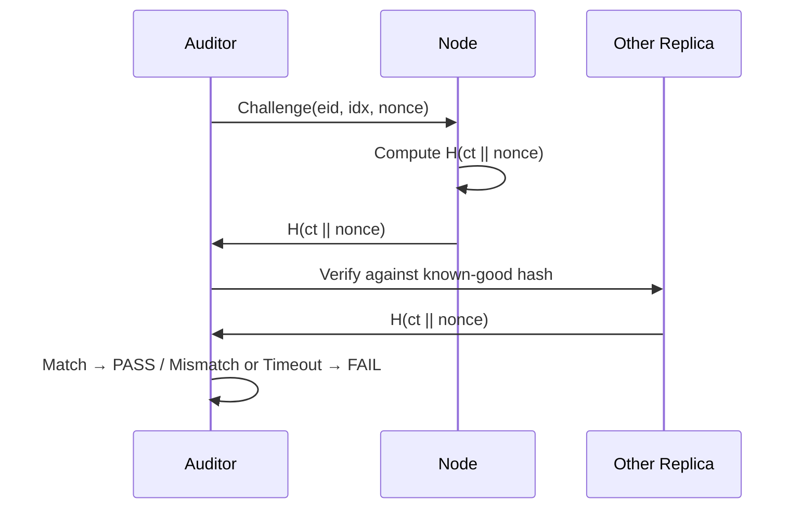

---

## 5. Transfer Flow (Sequence)

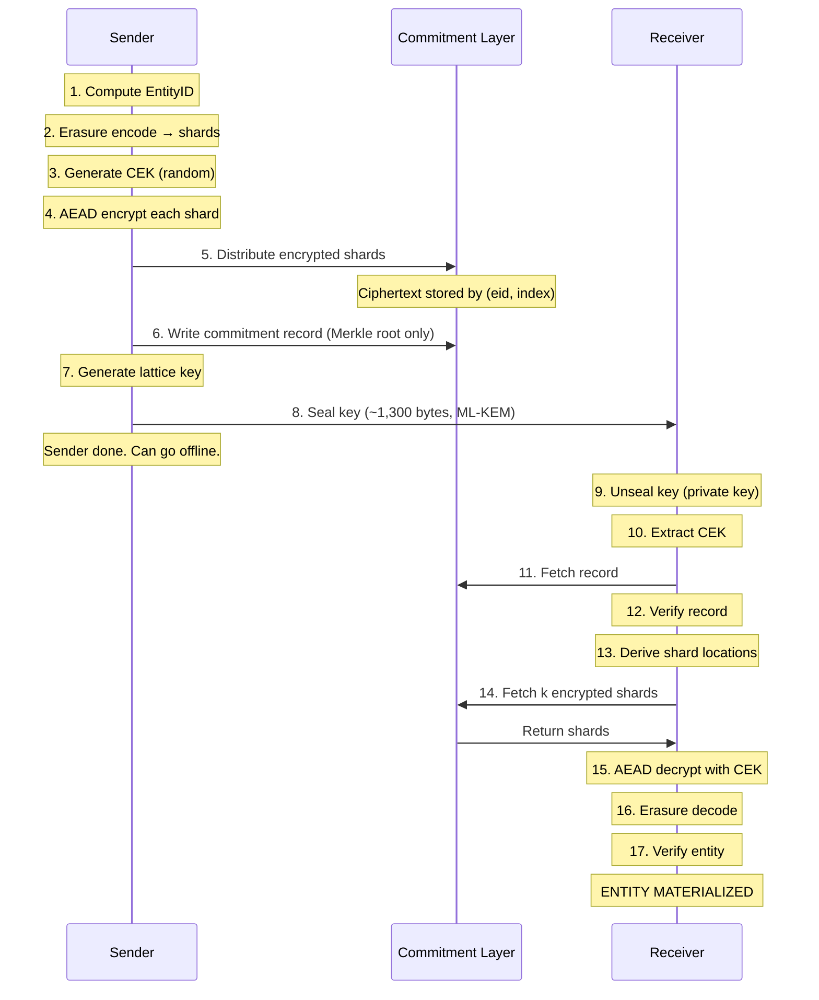

---

## 6. Security Layers

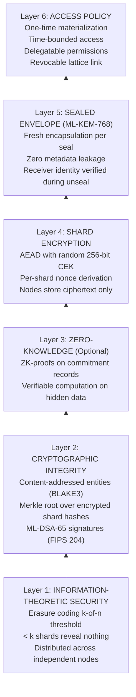

### Attack Surface Closure (v1 → v2)

```
  LEAK 1: Lattice Key (in transit)
  v1: ✗ Plaintext JSON with shard_ids, encoding params, sender_id
  v2: ✓ Sealed envelope — opaque ciphertext, zero metadata

  LEAK 2: Commitment Log (at rest)
  v1: ✗ Listed all shard_ids in plaintext
  v2: ✓ Merkle root only — hashes of ciphertext, no individual IDs

  LEAK 3: Commitment Nodes (at rest)
  v1: ✗ Stored plaintext shards, served to anyone
  v2: ✓ AEAD-encrypted ciphertext — useless without CEK
```

---

## 7. Data Flow Summary

| Stage | Data Size | Who Performs | Network Cost |
|-------|-----------|-------------|-------------|
| Entity → Shards | O(entity) | Sender (local) | None |
| Shards → Encrypted Shards | O(entity) + O(n×32) tags | Sender (local) | None |
| Encrypted Shards → Nodes | O(entity × replication) | Sender → Network | Amortized, async |
| Commitment Record | O(1) ~512B | Sender → Log | Minimal |
| **Lattice Key** | **O(1) ~1,300B sealed** | **Sender → Receiver** | **Near zero** |
| Encrypted Shards → Receiver | O(entity) | Network → Receiver | Local fetches |
| Decrypt + Decode | O(entity) | Receiver (local) | None |

**Critical insight**: The sender-to-receiver direct path carries O(1) data. The O(entity)
work happens between sender↔network (commit phase) and network↔receiver (materialize phase),
where "network" means **nearby commitment nodes**.

**Honest cost accounting**: Total system bandwidth is O(entity × replication_factor) + O(entity),
which is strictly greater than direct transfer's O(entity). The advantage is *not* bandwidth
reduction — it is bottleneck relocation: replacing one long-haul O(entity) transfer with
parallel local O(entity/k) fetches, plus amortized fan-out to multiple receivers.

---

## 8. Technology Choices

| Component | Recommended | Rationale |
|-----------|------------|-----------|
| Hash function | BLAKE3 | Fast, secure, parallelizable, ZK-friendly |
| Signatures | ML-DSA-65 (FIPS 204) | Post-quantum (Dilithium); NIST Level 3 |
| Key encapsulation | ML-KEM-768 (FIPS 203) | Post-quantum (Kyber); replaces X25519 |
| Erasure coding | Vandermonde RS over GF(256) | Any k-of-n reconstruction (polynomial 0x11D) |
| Commitment log | Merkle DAG / append-only ledger | Immutable, verifiable, decentralizable |
| Shard placement | Consistent hashing (jump hash) | Deterministic, balanced, minimal disruption |
| Shard encryption | XChaCha20-Poly1305 | AEAD, fast, nonce-misuse resistant |
| Storage proofs | Challenge-response (H(ct ‖ nonce)) | Lightweight, no SNARKs/VDFs needed |
| Node identity | ML-DSA-65 attestation / SPIFFE SVID | Sybil resistance via verifiable identity |

---

## 9. Economics Engine

The economics module manages the incentive layer: node staking, reward distribution, progressive slashing, and correlation penalties.

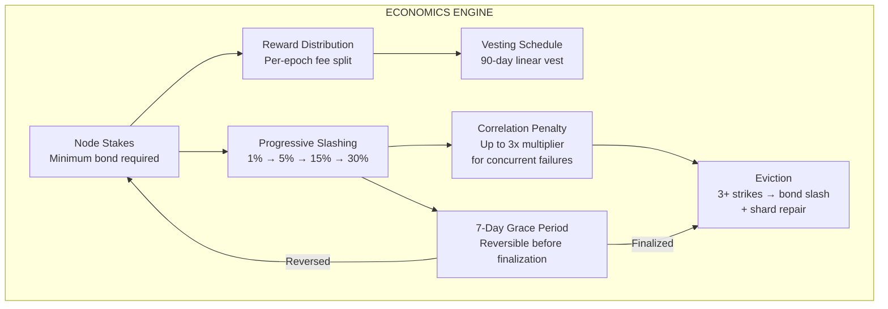

**Key design decisions:**
- Progressive slashing tiers prevent accidental total loss
- Correlation penalty (Ethereum-inspired) deters coordinated attacks
- 7-day grace period allows reversal of incorrect slashes
- 30-day offense decay enables rehabilitation

---

## 10. Enforcement Pipeline

Seven enforcement mechanisms spanning the protocol lifecycle.

```mermaid
flowchart TD
    subgraph Enforcement["ENFORCEMENT PIPELINE"]
        PDP["1. PDP Storage Proofs\n160-byte cryptographic proof\nof data possession"]
        PS["2. Programmable Slashing\nCustom SlashingConditions\nper-condition stake allocation"]
        ISD["3. Intersubjective Disputes\nStake-weighted voting\nfor subjective violations"]
        VDF["4. VDF-Enhanced Audits\nPhysics-based timing\nguarantees"]
        MEV["5. MEV Protection\nEncrypted submissions\nEpoch-based batching"]
        FV["6. Formal Verification\nSafety/liveness invariants\nProperty-based testing"]
        PD["7. Progressive Decentralization\nIrreversible phase transitions\nMetrics-based triggers"]
    end

    PDP -->|Growth Phase| PS
    PS -->|Growth Phase| MEV
    MEV -->|Maturity Phase| ISD
    ISD -->|Maturity Phase| VDF
    FV -->|All Phases| PDP
    PD -->|All Phases| FV
```

---

## 11. Progressive Decentralization

Enforcement governance evolves through three irreversible phases.

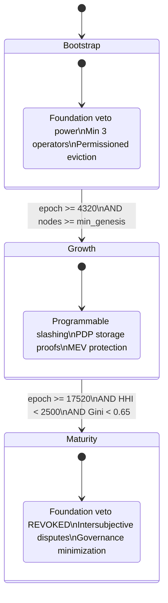

| Metric | Bootstrap | Growth | Maturity |
|--------|-----------|--------|----------|
| Operator count | >= 5 | >= 20 | >= 100 |
| HHI (concentration) | Any | < 5000 | < 2500 |
| Gini (distribution) | Any | < 0.80 | < 0.65 |
| Foundation veto | Yes | Yes | **No** |

---

## 12. Compliance Framework

Nine control families for regulatory compliance.

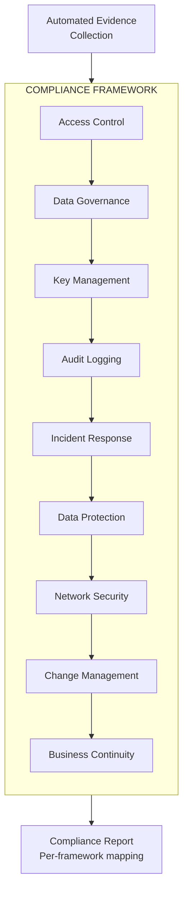

---

## 13. Federation Protocol

Cross-deployment discovery, trust escalation, and interoperability.

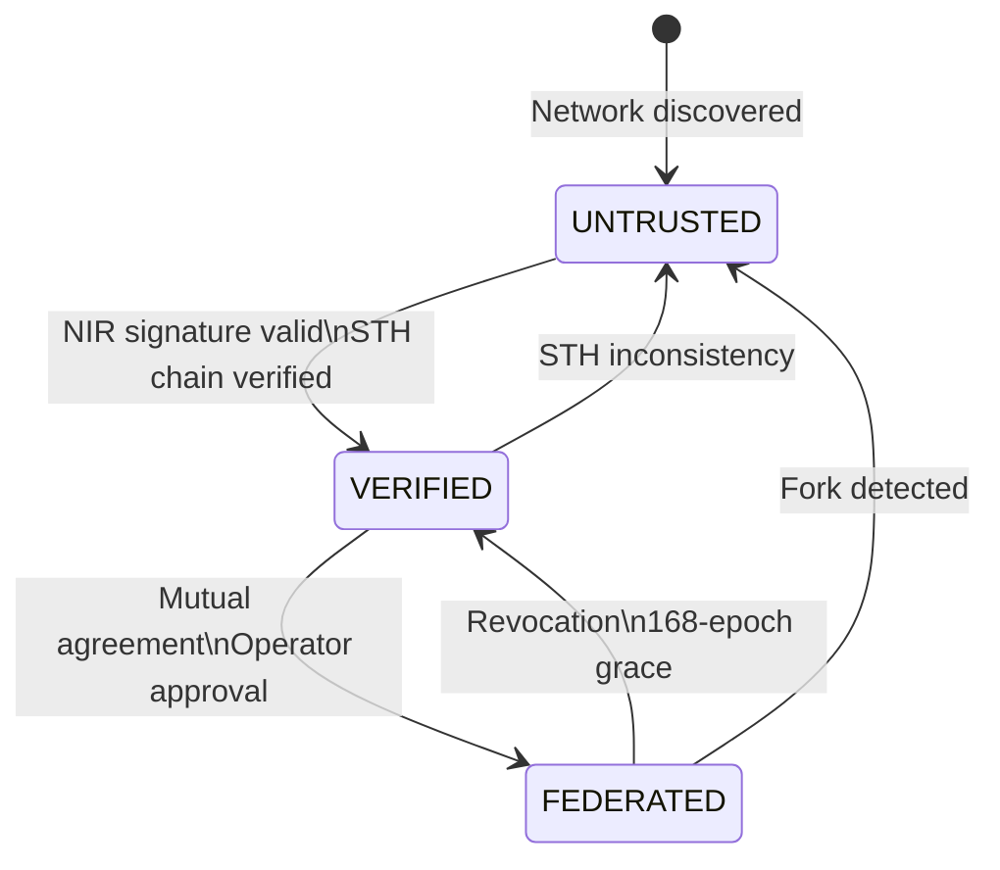

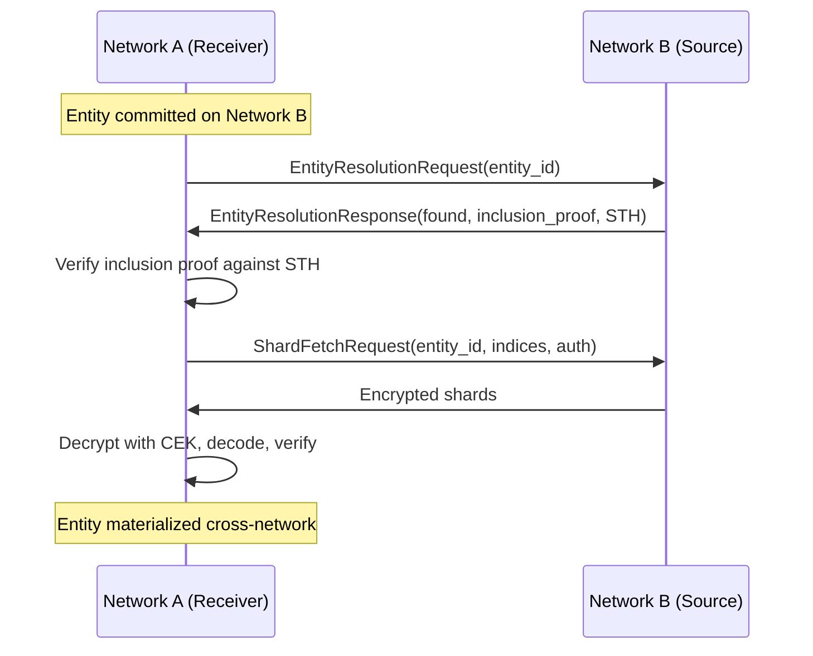

---

## 14. Streaming Protocol

Chunked streaming for large entities and live data.

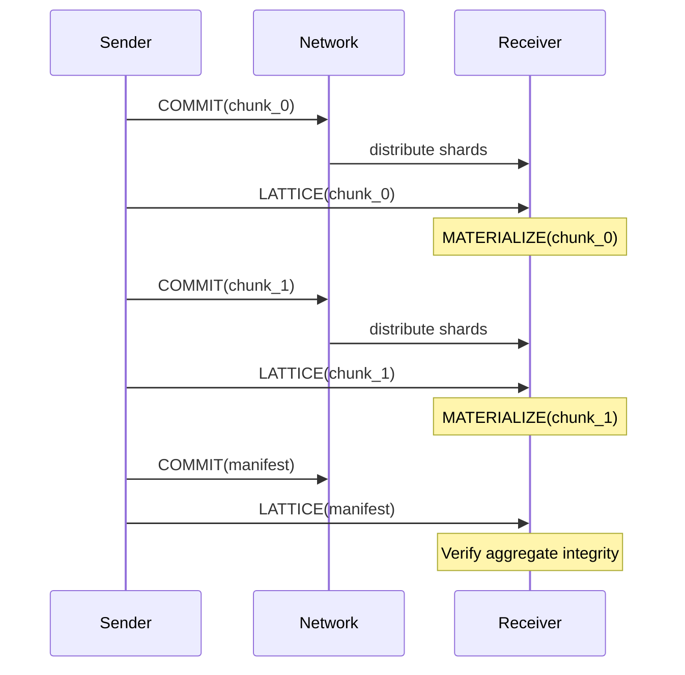

| Property | Batch Mode | Streaming Mode |
|----------|-----------|---------------|
| First-byte latency | O(entity_size) | O(chunk_size) |
| Memory footprint | O(entity_size) | O(chunk_size x pipeline_depth) |
| Failure granularity | All-or-nothing | Per-chunk recovery |

---

## 15. ZK Transfer Mode

Optional hiding commitments for low-entropy entities.

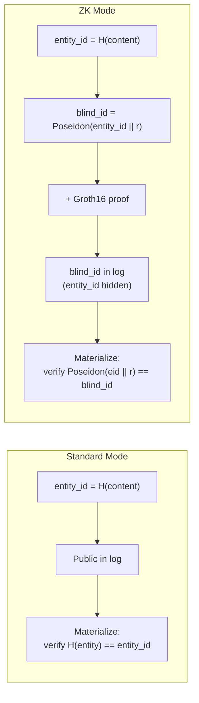

> **Warning:** ZK mode uses Groth16/BLS12-381, which is **not post-quantum safe**.

---

## 16. Bridge Protocol

Cross-chain transfer via the three-phase protocol.

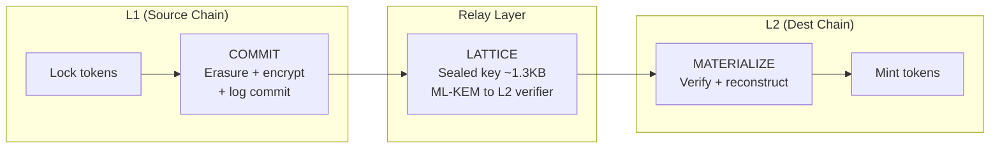

---

## 17. Backend Architecture

Pluggable commitment backends behind a common interface.

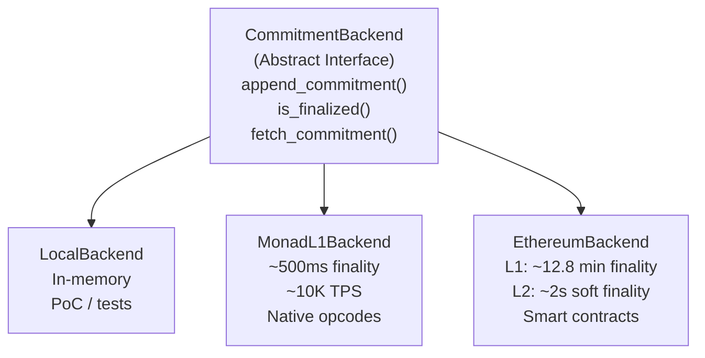

Usage:
```python
from ltp.backends import BackendConfig, create_backend

backend = create_backend(BackendConfig(backend_type="ethereum", eth_use_l2=True))
ref = backend.append_commitment(entity_id, record_bytes, signature, sender_vk)
```
