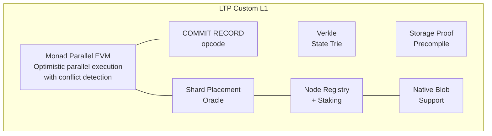
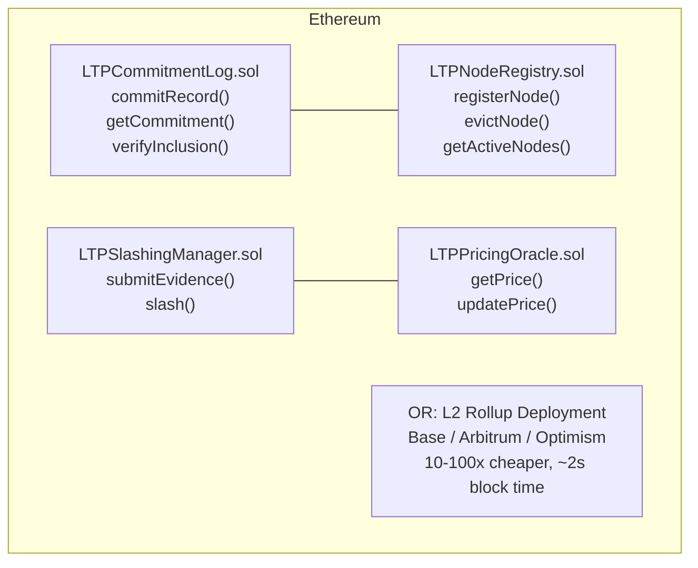

# Commitment Network: Layer 1 Options Analysis

**Status:** Proposal
**Date:** 2026-03-12
**Authors:** LTP Core Team
**Relates to:** Whitepaper §5.1, §5.2, §5.5

---

## Context

The LTP commitment network currently operates with an in-memory commitment log
and hash-chained append-only structure (CT-style Merkle log). The whitepaper
intentionally leaves the consensus and economic layers unspecified (§5.5),
defining only interfaces.

This document evaluates two concrete options for the underlying chain layer:

1. **Option 1 — Custom L1 (Monad Fork):** Build a purpose-built chain optimized
   for LTP's commitment workload.
2. **Option 2 — Ethereum L1/L2:** Deploy smart contracts on Ethereum mainnet or
   an L2 rollup.

Both options are implemented behind a pluggable `CommitmentBackend` abstraction
(`src/ltp/backends/`), allowing the protocol to operate on either chain without
modifying the core COMMIT / LATTICE / MATERIALIZE phases.

---

## Option 1: Custom L1 (Monad Fork + LTP Extensions)

### Architecture

Fork Monad — a parallel-execution EVM chain — and add LTP-specific extensions:



### LTP-Specific Modifications

| Extension | Purpose | Benefit |
|-----------|---------|---------|
| `COMMIT_RECORD` opcode | Native commitment record processing | Avoids ABI encoding overhead; ~21K gas vs ~80K |
| Verkle state trie | Compact state inclusion proofs | ~150B proofs vs ~1KB MPT proofs |
| Storage proof precompile | On-chain storage proof verification | Protocol-level PoS without SNARK overhead |
| Shard placement oracle | Consistent hashing as EVM precompile | Deterministic placement verified on-chain |
| Validator = storage operator | Validators must run commitment nodes | Economic alignment: stake = storage capacity |
| Native blob batching | EIP-4844-style commitment batching | Amortized cost for bulk commits |

### Performance Characteristics

| Metric | Value |
|--------|-------|
| Block time | ~500ms |
| Finality | Single-slot (deterministic, no reorgs) |
| Throughput | ~10,000 TPS (parallel execution) |
| Gas per commitment | ~21,000 (native opcode) |
| State proof size | ~150 bytes (Verkle) |
| Validator set | Tied to commitment node operators |

### Advantages

- **Purpose-built:** Every protocol-level decision optimized for LTP's workload
- **Single-slot finality:** Commitments are final in ~500ms with no reorg risk
- **High throughput:** Parallel EVM execution handles burst commitment loads
- **Compact proofs:** Verkle tries produce ~7x smaller inclusion proofs than MPT
- **Aligned incentives:** Validators ARE storage operators (no separation)
- **Native operations:** Commitment processing at the EVM opcode level
- **Full control:** Can evolve consensus, gas schedule, and state model freely

### Disadvantages

- **Bootstrap risk:** New chain needs its own validator set and economic security
- **Development cost:** Must maintain a chain fork long-term
- **Ecosystem isolation:** Not directly composable with Ethereum DeFi
- **Liquidity cold start:** Native token needs exchange listings, liquidity
- **Smaller security budget:** Economic security = market cap × stake ratio
- **Tooling gap:** Block explorers, wallets, RPC providers must be built/adapted

---

## Option 2: Ethereum L1/L2 Smart Contracts

### Architecture

Deploy Solidity contracts on Ethereum mainnet or an L2 rollup:



### Contract Architecture

| Contract | Gas Cost | Purpose |
|----------|----------|---------|
| `LTPCommitmentLog` | ~80K per commit | Append-only record storage + events |
| `LTPNodeRegistry` | ~120K per registration | Node admission, staking, metadata |
| `LTPSlashingManager` | ~150K per slash | Audit evidence verification, stake reduction |
| `LTPStoragePricing` | ~50K per update | Dynamic pricing oracle |

### Deployment Options

| Target | Block Time | Finality | Cost per Commit | TPS |
|--------|-----------|----------|-----------------|-----|
| Ethereum L1 | 12s | ~12.8 min (2 epochs) | ~$2-10 (80K gas) | ~30 |
| Base L2 | 2s | ~2s soft, L1 for hard | ~$0.01-0.05 | ~2,000 |
| Arbitrum L2 | 0.25s | ~0.25s soft, L1 for hard | ~$0.01-0.05 | ~4,000 |
| Optimism L2 | 2s | ~2s soft, L1 for hard | ~$0.01-0.05 | ~2,000 |

### Advantages

- **Battle-tested security:** $400B+ in economic security on Ethereum L1
- **Existing ecosystem:** Wallets, block explorers, RPC providers, auditors
- **DeFi composability:** Staking, restaking (EigenLayer), liquid staking
- **Developer tooling:** Hardhat, Foundry, OpenZeppelin, Slither, etc.
- **L2 scaling:** 10-100x cost reduction while inheriting L1 security
- **Credible neutrality:** No single entity controls Ethereum consensus
- **No cold start:** Immediate access to validators and economic security

### Disadvantages

- **Slower finality:** 12.8 min on L1; L2 soft finality is faster but weaker
- **Lower throughput:** ~30 TPS on L1 (L2 helps but adds trust assumptions)
- **Higher gas costs:** ~80K gas per commit (vs ~21K for native opcode)
- **Larger proofs:** MPT proofs ~1KB (vs ~150B Verkle)
- **No native operations:** Commitment processing goes through EVM ABI layer
- **Dependency risk:** Subject to Ethereum protocol changes and gas spikes

---

## Comparison Matrix

| Dimension | Custom L1 (Monad Fork) | Ethereum L1 | Ethereum L2 |
|-----------|----------------------|-------------|-------------|
| **Finality** | ~500ms (single-slot) | ~12.8 min (2 epochs) | ~2s soft / 12.8 min hard |
| **Throughput** | ~10,000 TPS | ~30 TPS | ~2,000-4,000 TPS |
| **Gas per commit** | ~21K (native) | ~80K (contract) | ~80K (cheaper in USD) |
| **Proof size** | ~150B (Verkle) | ~1KB (MPT) | ~1KB (MPT) |
| **Economic security** | Low (bootstrapping) | Very high ($400B+) | Inherits L1 |
| **Dev ecosystem** | Must build | Mature | Mature |
| **Composability** | Isolated | Full DeFi | Full DeFi |
| **Storage proofs** | Native precompile | SNARK-based | SNARK-based |
| **Control** | Full | None | Partial (L2 sequencer) |
| **Token requirement** | Native LTP token | ETH | ETH |
| **Time to production** | 12-18 months | 3-6 months | 2-4 months |
| **Maintenance burden** | Very high | Low | Medium |

---

## Recommendation

**Phase 1 (0-6 months): Start with Ethereum L2.**
- Deploy on Base or Arbitrum for low-cost, fast soft finality
- Leverage existing tooling, security, and liquidity
- Validate the economic model with real staking and slashing
- ~2s soft finality is acceptable for most LTP use cases

**Phase 2 (6-18 months): Evaluate custom L1 if needed.**
- If L2 throughput/finality becomes a bottleneck
- If native storage proofs are required (avoiding SNARK overhead)
- If the LTP network grows large enough to justify its own security budget
- Fork Monad at this stage with proven economic parameters from Phase 1

**Phase 3 (18+ months): Hybrid or migration.**
- Bridge between Ethereum and custom L1 for settlement + execution split
- Ethereum for final settlement (high security), custom L1 for execution (speed)
- Or fully migrate to custom L1 if network economics support it

This phased approach minimizes bootstrap risk while preserving the option to
build a purpose-built chain once the protocol's requirements are proven.

---

## Implementation

Both options are implemented in `src/ltp/backends/`:

```
src/ltp/backends/
├── __init__.py          # Package exports
├── base.py              # CommitmentBackend abstract interface
├── local.py             # LocalBackend (in-memory, PoC/tests)
├── monad_l1.py          # MonadL1Backend (custom L1 simulation)
├── ethereum.py          # EthereumBackend (L1/L2 simulation)
└── factory.py           # create_backend() factory function
```

Usage:
```python
from ltp.backends import BackendConfig, create_backend

# Option 1: Custom L1
backend = create_backend(BackendConfig(
    backend_type="monad-l1",
    monad_block_time_ms=500,
    min_stake_wei=10_000,
))

# Option 2: Ethereum L2
backend = create_backend(BackendConfig(
    backend_type="ethereum",
    eth_use_l2=True,
    eth_l2_name="base",
    eth_finality_mode="safe",
))

# Append a commitment (same API for both)
ref = backend.append_commitment(entity_id, record_bytes, signature, sender_vk)
assert backend.is_finalized(entity_id)
```

Tests: `tests/test_backends.py` — 40+ tests covering interface contract,
backend-specific behavior, and cross-backend comparisons.
