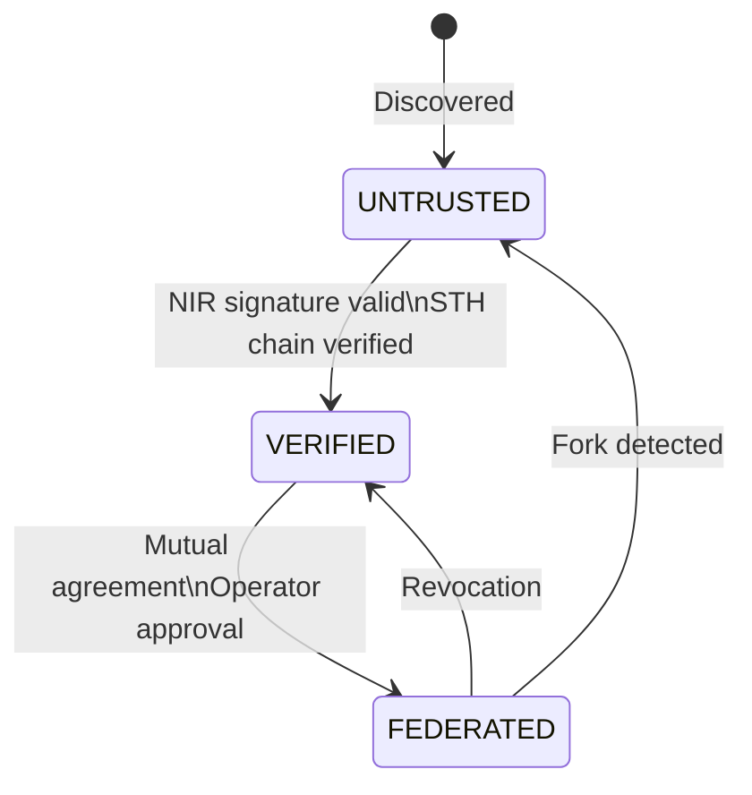
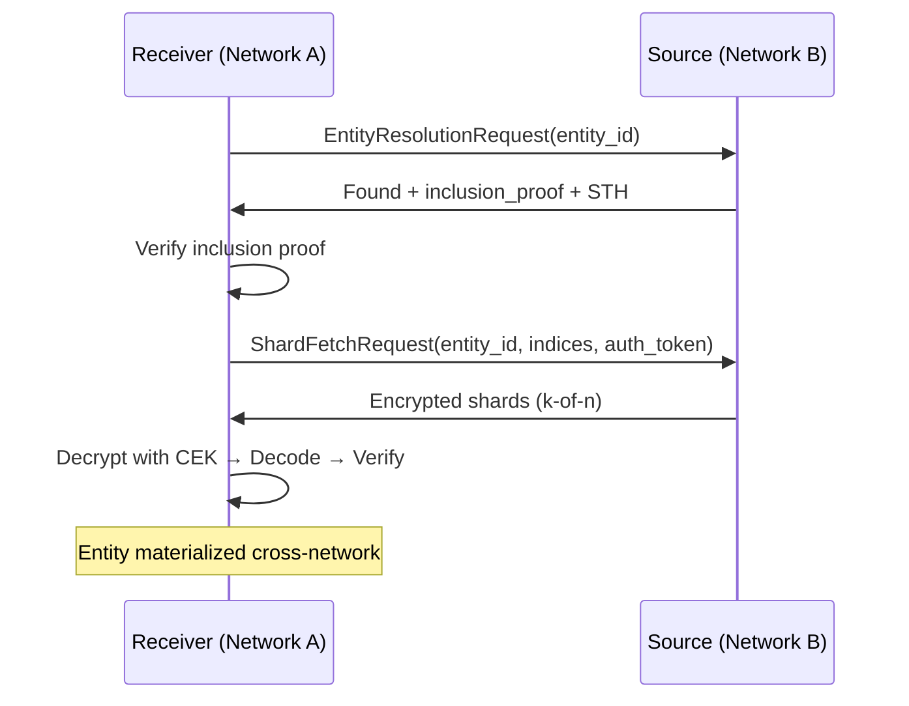

# Cross-Deployment Federation Protocol

**Status:** Proposal
**Date:** 2026-03-13
**Authors:** LTP Core Team
**Relates to:** Whitepaper §5.1, §5.2, §5.5, Open Question 7

---

## Context

Open Question 7 asks: *"How do independently bootstrapped LTP networks discover and trust each other's commitment nodes?"*

Each LTP deployment operates as a self-contained network:
- Its own `CommitmentLog` (append-only, hash-chained)
- Its own set of `CommitmentNode` instances storing encrypted shards
- Its own Signed Tree Heads (STHs) for fork detection
- Its own backend (Local, Monad L1, or Ethereum L2)

This is sufficient for single-organization deployments. However, three
real-world scenarios demand cross-network interoperability:

| Scenario | Example |
|----------|---------|
| **Multi-organization** | Company A commits entities that Company B needs to materialize |
| **Multi-cloud / hybrid** | Shards distributed across AWS, GCP, and on-prem networks |
| **Geographic optimization** | EU data committed to EU nodes, materialized by APAC receivers |

Without federation, each of these requires all participants to share a single
deployment -- creating centralization pressure, jurisdiction conflicts, and
single points of failure.

This document proposes a federation protocol that allows independent LTP
networks to discover, verify, and interoperate while maintaining the security
guarantees of the commitment layer.

---

## 1. Network Identity

Each LTP network has a **Network Identity Record (NIR)**, analogous to
Ethereum's ENR (EIP-778):

```
NetworkIdentityRecord:
  network_id: str              # H(genesis_sth || operator_vk) — globally unique
  operator_vk: bytes           # ML-DSA-65 verification key of network operator
  genesis_sth: dict            # First Signed Tree Head (immutable anchor)
  api_endpoint: str            # gRPC/HTTPS endpoint for federation API
  commitment_backend: str      # "local" | "monad-l1" | "ethereum-l2"
  chain_id: int | None         # L1/L2 chain ID (None for local backend)
  region_hint: str             # Primary geographic region (e.g., "eu-west-1")
  node_count: int              # Current active commitment node count
  protocol_version: str        # Federation protocol version (semver)
  signature: bytes             # ML-DSA-65 signature over all fields above
```

The `network_id` is derived from the genesis STH and operator key, making it
deterministic and unforgeable. Two networks with different genesis histories
will always have different identities.

---

## 2. Network Discovery

### DNS-Based Discovery

Networks publish discovery records via DNS TXT records, following the pattern
established by Ethereum's EIP-778 and discv5:

```
DNS Zone: _ltp-fed.<domain>

Records:
  _ltp-fed.example.com  TXT  "enr:<base64-encoded NIR>"
  _ltp-fed.example.com  TXT  "v=ltp1 net=<network_id_hex[:16]>"
  _ltp-nodes.example.com  TXT  "cap=1000 region=eu-west-1 backend=ethereum-l2"
```

### Discovery Protocol

```
DiscoveryFlow:
  1. Operator configures seed peers (manual bootstrap, like Bitcoin DNS seeds)
  2. Each network maintains a peer table of known NIRs
  3. Peer exchange: connected networks share their peer tables (gossip)
  4. DNS lookup: resolve _ltp-fed.<domain> for domain-based discovery
  5. On-chain registry (optional): NIRs published to shared L1 contract

PeerTable:
  - max_peers: 256                  # Bounded to prevent resource exhaustion
  - refresh_interval_s: 3600       # Re-verify NIR signatures hourly
  - eviction_policy: "least-recently-verified"
  - seed_peers: list[str]          # Bootstrap endpoints (operator-configured)
```

### Discovery Methods Compared

| Method | Trust Assumption | Latency | Availability |
|--------|-----------------|---------|--------------|
| Manual seed peers | Operator trusts seeds | None (preconfigured) | Operator-dependent |
| DNS TXT records | DNSSEC chain | ~100ms | DNS infrastructure |
| Peer gossip | Existing peer is honest | ~1s | Requires 1+ connected peer |
| On-chain registry | L1 consensus | ~12s (Ethereum) | Chain liveness |

**Recommendation:** Use manual seeds for bootstrap, DNS for steady-state
discovery, and on-chain registry for networks sharing an L1 backend.

---

## 3. Trust Levels

Federation uses a three-tier trust model with explicit escalation:

```
TrustLevel (enum):
  UNTRUSTED   = 0   # Discovered but not verified
  VERIFIED    = 1   # NIR signature valid, STH chain verified
  FEDERATED   = 2   # Mutual agreement, cross-network operations enabled
```



### Trust Level Properties

| Property | UNTRUSTED | VERIFIED | FEDERATED |
|----------|-----------|----------|-----------|
| NIR signature verified | No | Yes | Yes |
| STH consistency checked | No | Yes | Yes |
| Cross-network entity resolution | No | No | Yes |
| Cross-network shard fetch | No | No | Yes |
| STH exchange (monitoring) | No | Yes | Yes |
| Mutual federation agreement | No | No | Yes |
| Shard placement on remote nodes | No | No | Yes |

### Escalation Protocol

```
Trust Escalation Flow:

UNTRUSTED → VERIFIED:
  1. Fetch remote NIR via discovery
  2. Verify ML-DSA-65 signature on NIR
  3. Fetch remote genesis STH
  4. Verify genesis STH is internally consistent
  5. Fetch current STH, verify hash chain from genesis → current
  6. Store verified NIR in local peer table
  Duration: seconds (automated)

VERIFIED → FEDERATED:
  1. Operator A initiates federation request to network B
  2. Network B's operator reviews request (manual approval)
  3. Both networks exchange FederationAgreement:
     - Permitted operations (entity resolution, shard fetch, placement)
     - Rate limits and quota
     - Revocation conditions
     - Expiry epoch (must be renewed)
  4. Agreement signed by both operator_vk keys
  5. Agreement published to both commitment logs (auditable)
  Duration: hours to days (requires human approval)

FEDERATED → VERIFIED (Revocation):
  1. Either operator publishes FederationRevocation to their log
  2. Revocation propagates via STH exchange
  3. All cross-network operations cease after grace period (168 epochs)
  4. In-flight materializations complete; no new ones accepted
```

---

## 4. Cross-Network Entity Resolution

When a receiver has an `entity_id` but does not know which network holds the
commitment record, the federation layer resolves it:

```
Entity Resolution Protocol:

1. Local lookup:
   entity_id → local CommitmentLog.fetch(entity_id)
   If found: return local record (fast path)

2. Network hint (if provided by sender):
   entity_id was sent with network_id hint in the Lattice
   → query specific federated network directly

3. Federated broadcast (last resort):
   For each federated peer:
     query: EntityResolutionRequest(entity_id, requesting_network_id)
     response: EntityResolutionResponse(
       found: bool,
       network_id: str,
       commitment_ref: str,      # Hash of commitment record
       inclusion_proof: dict,    # Merkle inclusion proof from remote log
       sth: dict                 # Current STH for verification
     )
   Accept first valid response (verify inclusion proof against STH)
```

### Entity ID Namespacing

To avoid entity ID collisions across networks, entity IDs incorporate
network identity:

```
Namespaced Entity ID:
  global_entity_id = H(network_id || local_entity_id)

  Resolution:
  - If entity_id matches local namespace prefix → local lookup
  - If entity_id matches known federated namespace → direct query
  - Otherwise → federated broadcast
```

### Rate Limiting

```
FederationQuota:
  - entity_resolution_per_minute: 100       # Per federated peer
  - shard_fetch_per_minute: 500             # Per federated peer
  - max_concurrent_materializations: 10     # Across all peers
  - burst_allowance: 2x                     # Temporary burst above quota
  - quota_reset_epoch_interval: 168         # Weekly quota reset
```

---

## 5. Shard Resolution and Cross-Network Fetch

Once entity resolution identifies the home network, shard retrieval follows:



```
Cross-Network Materialization Flow:

Receiver (Network A) wants to materialize entity_id committed on Network B:

1. RESOLVE: entity_id → Network B (via entity resolution protocol)

2. VERIFY COMMITMENT:
   a. Fetch CommitmentRecord from Network B's log
   b. Verify inclusion proof against Network B's current STH
   c. Verify record signature against sender's ML-DSA-65 vk
   d. Verify Network B's STH against any shared L1 anchor (if available)

3. LOCATE SHARDS:
   a. Derive shard locations: entity_id + shard_index → placement on Network B
   b. Network B returns shard location map:
      ShardLocationMap:
        entity_id: str
        shard_count: int (n)
        locations: list[ShardLocation]

      ShardLocation:
        shard_index: int
        node_endpoints: list[str]   # Ordered by preference
        region: str
        last_audit_pass_epoch: int  # Freshness of storage proof

4. FETCH SHARDS:
   a. Fetch k-of-n encrypted shards from Network B's commitment nodes
   b. Each shard is verified against the shard_map_root in the commitment record
   c. Shards are encrypted — Network B nodes cannot read content
   d. Network A's receiver decrypts locally using CEK from Lattice

5. RECONSTRUCT:
   a. Standard Reed-Solomon reconstruction (same as local materialization)
   b. Verify content_hash matches commitment record
```

### Fetch Authentication

Cross-network shard fetches require proof of authorization:

```
ShardFetchRequest:
  entity_id: str
  shard_index: int
  requesting_network_id: str
  federation_agreement_ref: str     # Reference to signed agreement
  request_signature: bytes          # Signed by requesting network's operator_vk
  timestamp: float                  # Prevents replay (valid window: 60s)

Verification (by serving node):
  1. Check federation_agreement_ref is valid and not revoked
  2. Verify request_signature against requesting network's operator_vk
  3. Check timestamp is within valid window
  4. Check rate limits for requesting network
  5. Serve encrypted shard (node cannot read it regardless)
```

---

## 6. STH Exchange and Cross-Network Verification

Signed Tree Heads are the foundation of fork detection. Federated networks
exchange STHs to enable cross-network consistency monitoring:

```
STH Exchange Protocol:

Frequency: Every epoch (or on-demand for verification)

STHExchangeMessage:
  source_network_id: str
  sth: dict                       # {sequence, root_hash, timestamp, record_count}
  sth_signature: bytes            # Signed by source network's operator_vk
  previous_sth_hash: str          # Hash of last STH sent to this peer
  chain_anchor: dict | None       # L1 transaction hash if STH is anchored

Verification by receiving network:
  1. Verify sth_signature against source's operator_vk
  2. Verify previous_sth_hash matches last received STH from this source
  3. Verify sequence is monotonically increasing
  4. If chain_anchor present: verify L1 inclusion
  5. Store in local STH history for this peer

Fork Detection:
  If a network receives two STHs with the same sequence but different
  root_hash values from the same source → cryptographic proof of equivocation.

  ForkEvidence:
    network_id: str
    sth_a: dict                    # First conflicting STH
    sth_b: dict                    # Second conflicting STH
    sth_a_signature: bytes
    sth_b_signature: bytes
    detected_by: str               # Network that detected the fork
    detection_epoch: int

  Response to fork detection:
    1. Immediately downgrade trust: FEDERATED → UNTRUSTED
    2. Publish ForkEvidence to local commitment log (permanent record)
    3. Broadcast ForkEvidence to all federated peers
    4. If shared L1: submit ForkEvidence on-chain for slashing
    5. Halt all in-flight cross-network operations with forking network
```

### Consistency Gossip

Beyond bilateral STH exchange, networks participate in consistency gossip:

```
Consistency Gossip:
  - Each network periodically asks random federated peers:
    "What is your latest STH from Network X?"
  - If responses diverge → Network X may be presenting different views
    to different peers (split-view attack)
  - Detected via: H(sth_from_A_about_X) != H(sth_from_B_about_X)
    for same sequence number
```

---

## 7. Security Model

### What a Malicious Federated Network CAN Do

| Attack | Impact | Mitigation |
|--------|--------|------------|
| Refuse shard fetches | Denial of service for cross-network materialization | Redundant federation agreements; sender replicates to multiple networks |
| Return stale STHs | Receiver sees outdated commitment state | STH freshness checks; L1 anchoring provides ground truth |
| Withhold entity resolution responses | Receiver cannot find entity | Broadcast to multiple peers; sender includes network_id hint in Lattice |
| Log entity resolution queries | Learn which entities are being materialized | Entity ID is opaque (hash-derived); no content leakage |
| Slow-roll shard responses | Degrade materialization latency | Timeout + fallback to alternative replicas; latency monitoring |

### What a Malicious Federated Network CANNOT Do

| Attack | Why It Fails |
|--------|-------------|
| Read shard content | Shards are AEAD-encrypted; nodes never have the CEK |
| Forge commitment records | Records are ML-DSA-65 signed by the sender, not the network |
| Present a forked log without detection | STH exchange + consistency gossip detect equivocation |
| Modify shards in transit | Shard integrity verified against shard_map_root in commitment record |
| Impersonate another network | Network identity is bound to ML-DSA-65 key; NIR signature verification prevents impersonation |
| Escalate trust without operator approval | VERIFIED -> FEDERATED requires mutual signed agreement with human approval |
| Retroactively revoke without trace | Federation agreements and revocations are committed to the append-only log |

### Threat Hierarchy

```
Threat Level 1 (Availability):
  Malicious network withholds service → mitigated by redundancy

Threat Level 2 (Integrity):
  Malicious network forks its log → detected by STH exchange
  Malicious network serves wrong shards → detected by shard_map_root check

Threat Level 3 (Confidentiality):
  Malicious network reads shard content → impossible (AEAD encryption)
  Malicious network correlates entity access patterns → partial (see Privacy below)

Privacy Consideration:
  Cross-network entity resolution reveals that a receiver is interested in
  a specific entity_id. The entity_id itself is a hash and reveals no content,
  but access patterns over time could be correlated. Mitigation: batch
  resolution requests, use PIR (Private Information Retrieval) for sensitive
  lookups (future work).
```

---

## 8. Trust Anchoring via Shared L1

When two federated networks share an L1 backend (both on Ethereum L2, or
both anchoring to the same Monad L1), the L1 serves as a trust anchor:

```
L1 Trust Anchor Protocol:

Shared L1 Contract: LTPFederationRegistry
  - registerNetwork(nir: bytes, signature: bytes)
  - publishSTH(network_id: bytes32, sth: bytes, signature: bytes)
  - submitForkEvidence(evidence: bytes)
  - getFederationAgreement(net_a: bytes32, net_b: bytes32) → Agreement

Benefits:
  1. Network identity is L1-verifiable (not just peer-to-peer)
  2. STH anchoring provides tamper-proof ordering
  3. Fork evidence submission triggers automatic slashing
  4. Federation agreements are L1-enforced (not just bilateral trust)
```

### Trust Without Shared L1

Networks on different chains (e.g., Network A on Ethereum L2, Network B on
Monad L1) fall back to bilateral trust:

```
Trust Comparison:

| Property                  | Shared L1          | No Shared L1       |
|---------------------------|--------------------|--------------------|
| STH anchoring             | L1 contract        | Bilateral exchange |
| Fork evidence             | On-chain, slashable| Gossip-based       |
| Federation agreement      | L1-enforced        | Bilateral signed   |
| Identity verification     | L1 registry        | NIR signature only |
| Dispute resolution        | L1 smart contract  | Out-of-band        |
| Economic deterrent        | Slashing (L1 stake)| Reputation only    |
```

### Cross-Chain Bridge (Future)

For networks on different L1s, a cross-chain bridge could relay STH
attestations:

```
Cross-Chain STH Relay:
  Network A (Ethereum L2) → Bridge Contract → Network B (Monad L1)

  Relay Message:
    source_chain_id: int
    source_network_id: bytes32
    sth: bytes
    l1_inclusion_proof: bytes    # Proof that STH was anchored on source L1
    relay_signature: bytes       # Signed by bridge operator

  Trust assumption: bridge operator is honest (can be decentralized via
  multi-sig or light client verification)
```

---

## 9. Implementation Phases

### Phase 1: Discovery (Months 1-3)

```
Deliverables:
  - NetworkIdentityRecord generation and signing
  - DNS TXT record publication and resolution
  - Manual seed peer configuration
  - PeerTable with signature verification
  - NIR gossip between connected peers

New modules:
  src/ltp/
  ├── federation/
  │   ├── __init__.py
  │   ├── identity.py          # NIR generation, signing, verification
  │   ├── discovery.py         # DNS, seed peers, peer table
  │   └── trust.py             # TrustLevel enum, escalation state machine

Trust ceiling: VERIFIED (discovery and verification only)
```

### Phase 2: Verification (Months 3-6)

```
Deliverables:
  - STH exchange protocol
  - Fork detection and evidence generation
  - Consistency gossip
  - FederationAgreement signing and storage
  - Trust escalation to FEDERATED (with operator approval)
  - Rate limiting and quota enforcement

New modules:
  src/ltp/federation/
  ├── sth_exchange.py          # STH exchange, fork detection
  ├── agreement.py             # Federation agreement lifecycle
  └── quota.py                 # Rate limiting, quota tracking

Trust ceiling: FEDERATED (bilateral operations enabled)
```

### Phase 3: Full Federation (Months 6-12)

```
Deliverables:
  - Cross-network entity resolution
  - Cross-network shard fetch with authentication
  - Cross-network materialization flow (end-to-end)
  - L1 trust anchoring contract (for shared-L1 networks)
  - On-chain federation registry
  - Monitoring dashboard for federation health

New modules:
  src/ltp/federation/
  ├── resolution.py            # Entity resolution protocol
  ├── shard_fetch.py           # Authenticated cross-network shard fetch
  ├── anchor.py                # L1 trust anchoring
  └── monitor.py               # Federation health monitoring

Updated modules:
  src/ltp/commitment.py        # CommitmentNetwork gains federation awareness
  src/ltp/backends/base.py     # CommitmentBackend gains federation interface
```

---

## Comparison: Federation vs. Single Deployment

| Dimension | Single Deployment | Federated Networks |
|-----------|------------------|-------------------|
| **Trust model** | Implicit (same operator) | Explicit (three-tier) |
| **Entity resolution** | Local log lookup | Local + federated broadcast |
| **Shard fetch latency** | Intra-network (~10ms) | Cross-network (~50-200ms) |
| **Fork detection** | Internal STH monitoring | Cross-network STH exchange |
| **Failure domain** | Single network | Independent per network |
| **Jurisdiction** | Single | Per-network (geographic flexibility) |
| **Complexity** | Low | Medium (discovery + trust + resolution) |
| **Security surface** | Smaller | Larger (cross-network API exposure) |

---

## Recommendation

**Immediate (P0):**
- Define and implement `NetworkIdentityRecord` (foundation for everything else)
- Implement DNS-based discovery with manual seed peers
- Implement trust level state machine (UNTRUSTED -> VERIFIED -> FEDERATED)

**Short-term (P1):**
- Implement STH exchange and fork detection between peers
- Implement `FederationAgreement` signing and lifecycle
- Deploy rate limiting and quota enforcement

**Medium-term (P2):**
- Implement cross-network entity resolution and shard fetch
- Deploy L1 trust anchoring for networks on shared chains
- Build federation health monitoring

**Future (P3):**
- Cross-chain STH relay bridge
- Private Information Retrieval for entity resolution
- Automated federation agreement negotiation (reducing operator burden)
