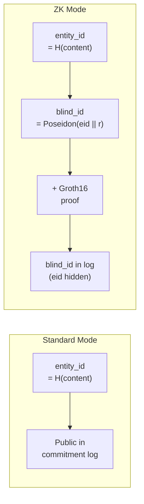
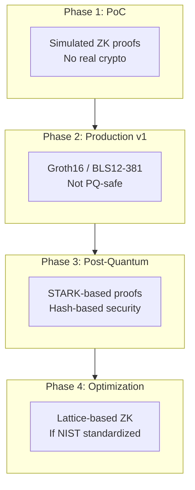

# ZK Transfer Mode: Design and Upgrade Path

**Status:** Proposal
**Date:** 2026-03-13
**Authors:** LTP Core Team
**Relates to:** Whitepaper §3.2, §3.2.1–§3.2.4, §3.3.3, §10 Open Question 8

---

> **WARNING: ZK Transfer Mode is NOT post-quantum safe.** Groth16 over BLS12-381 relies
> on bilinear pairings broken by Shor's algorithm. Standard LTP (ML-KEM-768, ML-DSA-65,
> BLAKE3) is fully post-quantum. **ZK mode MUST NOT be used in deployments with a
> quantum-adversary threat model.** See §7 for the post-quantum upgrade path.

---

## 1. Why ZK Transfer Mode Exists

Standard LTP commits entities by publishing `entity_id` in the public commitment log.
This is a Poseidon hash of the entity content, shape, timestamp, and sender verification
key. While the entity *content* is hidden (encrypted, erasure-coded, and sharded), the
`entity_id` itself is a deterministic fingerprint. An adversary who can guess candidate
entities can compute `entity_id` for each and match against the public log.

The whitepaper identifies this as the **EntityID fingerprinting limitation** (§3.3.3,
Theorem 5 / TCONF). For low-entropy entities (e.g., a binary yes/no vote, a small
enumerable set), the fingerprinting attack is practical.

**ZK mode closes this gap.** It replaces the public `entity_id` with a hiding commitment
(`blind_id`) and a zero-knowledge proof that the commitment is well-formed. The
commitment log operator learns nothing about the committed entity beyond its existence.

### When to Use ZK Mode

| Scenario | Recommendation |
|----------|---------------|
| High-entropy entities (large documents, images) | Standard mode sufficient |
| Low-entropy entities (votes, status flags, small enums) | **ZK mode required** |
| Quantum-adversary threat model | Standard mode only (ZK mode is unsafe) |
| Regulatory requirement for content opacity | ZK mode recommended |
| Performance-constrained environment | Standard mode (ZK adds ~2s proving) |



---

## 2. Hiding Commitment Scheme

ZK mode replaces the plaintext `entity_id` in the commitment record with a Pedersen-style
commitment using the Poseidon hash function:

```
blind_id = Poseidon(entity_id || r)
```

Where:
- `entity_id` = `Poseidon(entity_content || shape || timestamp || sender_vk)` (32 bytes)
- `r` = 256-bit blinding factor from CSPRNG (32 bytes, never published)

**Why Poseidon, not BLAKE3?** Poseidon is designed for low R1CS gate count, making it
efficient inside ZK circuits. BLAKE3 is LTP's standard hash, but its bitwise operations
are expensive in arithmetic circuits. ZK mode uses Poseidon for all circuit-internal
hashing; BLAKE3 remains in use for non-circuit operations (shard hashing, signatures).

**Hiding property.** Since `r` is 256 bits of CSPRNG output, `blind_id` is
computationally indistinguishable from a random value. An adversary who knows candidate
entities `(e_0, e_1)` cannot determine which was committed — `entity_id` is absent from
the log, and Poseidon preimage resistance prevents inverting `blind_id`.

**Binding property.** By Poseidon collision resistance, the sender cannot open `blind_id`
to two distinct `entity_id` values. Transfer immutability (whitepaper Theorem 8) is
preserved.

---

## 3. Modified Commitment Record

### Standard Mode Record

```json
{
  "entity_id":      "poseidon:abc123...",
  "shard_map_root": "poseidon:def456...",
  "encoding_params": { "n": 64, "k": 32, "algorithm": "reed-solomon-gf256" },
  "shape":          "application/json",
  "timestamp":      1740422400,
  "signature":      "ml-dsa-65:sig..."
}
```

### ZK Mode Record

```json
{
  "mode":           "zk",
  "blind_id":       "poseidon:Poseidon(entity_id || r)",
  "shard_map_root": "poseidon:merkle_root_of_encrypted_shard_hashes",
  "encoding_params": { "n": 64, "k": 32, "algorithm": "reed-solomon-gf256",
                       "gf_poly": "0x11d", "eval": "vandermonde-powers-of-0x02" },
  "shape":          "application/json",
  "timestamp":      1740422400,
  "zk_proof":       "...",
  "signature":      "ml-dsa-65:sig..."
}
```

**Key differences:**
- `entity_id` replaced by `blind_id` (hiding commitment)
- `zk_proof` added (Groth16 proof over relation R_ZK)
- `mode: "zk"` flag signals ZK processing to commitment nodes
- ML-DSA-65 signature covers the entire record including `blind_id` and `zk_proof`
  (non-repudiation is preserved)

### Private LatticeKey (ZK Mode)

The `entity_id` and blinding factor travel privately in the sealed lattice key, not on
the public log:

```
LatticeKey (ZK mode) = {
  entity_id,      // 32 bytes — private
  r,              // 32 bytes — blinding factor
  cek,            // 32 bytes — CEK to decrypt shards
  commitment_ref, // 32 bytes — hash of the ZK commitment record
  access_policy
}
```

The receiver opens the commitment by verifying `Poseidon(entity_id || r) == blind_id`,
then proceeds with shard retrieval, AEAD decryption, erasure decoding, and entity
verification identically to standard LTP.

---

## 4. ZK Proof Specification

### Relation R_ZK

```
Public inputs:    blind_id, shape_hash, timestamp, sender_vk
Private witnesses: entity_id, r, entity_content

R_ZK is satisfied iff:
  (1) blind_id  = Poseidon(entity_id || r)
  (2) entity_id = Poseidon(entity_content || shape || timestamp || sender_vk)
```

- **Condition (1):** Commitment consistency — the public log entry is bound to a specific
  `entity_id`.
- **Condition (2):** Entity well-formedness — the `entity_id` was correctly derived from
  `entity_content`.

Together, they tie the public `blind_id` to a specific committed entity without revealing
it.

### Proof System: Groth16 over BLS12-381

| Property | Value |
|----------|-------|
| Proof system | Groth16 [Groth, 2016] |
| Curve | BLS12-381 |
| Hash in circuit | Poseidon |
| Proof size | ~192 bytes (constant) |
| Proving time | ~2 seconds (estimated) |
| Verification time | ~5 ms (constant, 3 pairings) |
| Trusted setup | Required (per-circuit MPC ceremony) |
| Post-quantum safe | **NO** |

### Why Groth16?

- **Minimal proof size** (~192 bytes) — important for on-chain verification cost
- **Constant-time verification** (~5 ms, 3 pairings) — efficient for commitment nodes
- **Mature tooling** — circom, snarkjs, arkworks all support Groth16/BLS12-381
- **Well-studied security** — years of deployment in production systems (Zcash, Tornado
  Cash, Filecoin)

### Trusted Setup Requirement

Groth16 requires a per-circuit structured reference string (SRS) generated by MPC. A
compromised SRS allows forging proofs (breaking soundness) — a forger could commit to
one entity and later claim it was a different one.

**Mitigation:**
- Use multi-party computation (MPC) ceremonies with N-of-N corruption threshold
- Publish SRS generation transcripts for public verification
- Circuit changes require a new ceremony (version the SRS alongside the circuit)

---

## 5. Content-Property Proofs

> This section addresses Open Question 8(a): circuit composition for application-layer
> predicates.

R_ZK as specified proves only commitment consistency — that `blind_id` is bound to a
valid `entity_id`. It does **not** prove anything about the entity's content. Many
applications need to prove content properties without revealing the content itself:

| Use Case | Property to Prove | Circuit Addition |
|----------|-------------------|-----------------|
| Financial compliance | `amount` in range [0, 1000] | Range proof gates |
| Schema validation | Entity is valid JSON matching schema S | JSON parser circuit |
| Timestamp bounds | `created_at` within last 24 hours | Comparison gates |
| Allowlist membership | `recipient` is in set {A, B, C} | Merkle membership proof |
| Threshold check | `score >= 70` without revealing score | Range proof gates |

### Circuit Composition Model

Content-property proofs extend R_ZK by adding predicate-specific gates to condition (2):

```
R_ZK_extended:
  Public inputs:    blind_id, shape_hash, timestamp, sender_vk, predicate_commitment
  Private witnesses: entity_id, r, entity_content

  (1) blind_id  = Poseidon(entity_id || r)                          // commitment consistency
  (2) entity_id = Poseidon(entity_content || shape || timestamp || sender_vk)  // well-formedness
  (3) P(entity_content) = true                                       // content predicate
  (4) predicate_commitment = Poseidon(P_description)                 // predicate binding
```

Where `P` is an application-defined predicate compiled to R1CS constraints.

### Predicate Library Architecture

```
Predicate Circuit Library:
  ├── range_proof(field, min, max)           # Prove field ∈ [min, max]
  ├── merkle_membership(leaf, root, path)    # Prove leaf ∈ Merkle tree
  ├── json_schema_check(content, schema)     # Prove content matches schema
  ├── regex_match(field, pattern)            # Prove field matches regex
  └── composite(P1, P2, ..., Pn)            # AND-composition of predicates

Composition rules:
  - Each predicate compiles to an R1CS gadget
  - Gadgets compose via shared wires on entity_content
  - Combined circuit = R_ZK base + gadget_1 + gadget_2 + ... + gadget_n
  - Each distinct composition requires its own trusted setup (Groth16 limitation)
```

### Trusted Setup Problem for Composed Circuits

Every distinct circuit composition requires a new Groth16 trusted setup ceremony. This is
the primary limitation of the Groth16-based approach for content-property proofs.

**Mitigation strategies:**

| Strategy | Trade-off |
|----------|-----------|
| Universal circuits (fixed max size) | Larger proofs, slower proving, but single setup |
| PLONK/Marlin (universal setup) | ~3x larger proofs than Groth16, but updatable SRS |
| Circuit template library | Pre-computed setups for common predicate combinations |
| STARK-based (no setup) | No trusted setup; see §6 for post-quantum benefits |

**Recommendation:** For the PoC, defer content-property proofs. For production, evaluate
PLONK as the proof system for composed circuits (universal setup eliminates per-circuit
ceremonies), or migrate to STARKs which require no trusted setup at all.

---

## 6. Post-Quantum Upgrade Path

> This section addresses Open Question 8(b): replacing BLS12-381 with a post-quantum
> proof system.

> **WARNING:** Current ZK mode (Groth16/BLS12-381) is broken by a cryptographically
> relevant quantum computer (CRQC). Shor's algorithm solves the discrete logarithm
> problem on elliptic curves in polynomial time, destroying both the hiding property of
> `blind_id` and the soundness of Groth16 proofs.

### Candidate Post-Quantum ZK Systems

| Property | Groth16/BLS12-381 (current) | STARK (hash-based) | Lattice-based ZK |
|----------|---------------------------|--------------------|--------------------|
| **Post-quantum safe** | **NO** | **YES** | **YES** (conjectured) |
| Proof size | ~192 bytes | ~50–200 KB | ~5–50 KB |
| Proving time | ~2 s | ~10–30 s | ~5–15 s |
| Verification time | ~5 ms | ~50–100 ms | ~20–50 ms |
| Trusted setup | Yes (per-circuit MPC) | **No** | **No** (typically) |
| Assumption | Bilinear pairings (DLP) | Hash collision resistance | Module-LWE / SIS |
| Maturity | Production | Production (StarkWare) | Research / early production |
| Recursion support | Via cycles of curves | Native (FRI-based) | Limited |
| Tooling | circom, arkworks, snarkjs | Stone, Winterfell, Plonky3 | Ligero++, Brakedown |
| Circuit-friendly hash | Poseidon | BLAKE3 or Rescue | Poseidon or BLAKE3 |
| On-chain verification cost | Low (~200K gas) | High (~1–2M gas) | Medium (~500K gas) |

### STARK Path (Recommended Near-Term)

**Advantages:**
- Transparent setup (no trusted ceremony) — eliminates the SRS trust assumption entirely
- Hash-based security assumption (collision resistance) — believed quantum-resistant
- BLAKE3-compatible — LTP's standard hash works natively, no Poseidon dependency
- Mature implementations (StarkWare/Stone prover, Winterfell, Plonky3)
- Natural recursion support for proof aggregation

**Disadvantages:**
- Proof size ~50–200 KB (vs. 192 bytes for Groth16) — significant on-chain cost increase
- Slower verification (~50–100 ms vs. ~5 ms)
- Higher proving time (~10–30 s vs. ~2 s)

**Mitigation for proof size:**
- Use STARK-to-SNARK wrapping (prove STARK validity inside a SNARK) for on-chain
  verification — reduces on-chain footprint while keeping STARK's PQ security for the
  core proof
- Batch multiple ZK commitment proofs into a single recursive STARK

### Lattice-Based Path (Medium-Term)

**Advantages:**
- Smaller proofs than STARKs (~5–50 KB)
- Aligns with LTP's existing lattice-based primitives (ML-KEM-768, ML-DSA-65)
- No trusted setup in most constructions

**Disadvantages:**
- No NIST-standardized lattice-based ZK system exists as of 2026
- Security reductions are less tight than hash-based STARKs
- Tooling is immature (Ligero++, Brakedown are research-grade)
- Concrete security parameters still under active study

### Recommended Migration Timeline

```
Phase 1 — Current (PoC):
  Simulated ZK proofs (see §8)
  No real cryptographic operations
  Focus on protocol integration and API correctness

Phase 2 — Production v1:
  Groth16 over BLS12-381 (as specified in whitepaper §3.2)
  Accept non-PQ status with clear warnings
  Deploy trusted setup ceremony for R_ZK

Phase 3 — Post-Quantum Upgrade:
  Replace Groth16 with STARK-based proof system
  Maintain blind_id = Poseidon(entity_id || r) commitment structure
  Re-prove R_ZK in STARK; no change to commitment record format
  Drop trusted setup requirement entirely

Phase 4 — Optimization (if lattice ZK matures):
  Evaluate lattice-based ZK for proof size reduction
  Only adopt after NIST standardization or equivalent review
```



### Backward Compatibility

The commitment record format is version-tagged by `mode`:

```json
{ "mode": "zk" }           // Phase 2: Groth16/BLS12-381
{ "mode": "zk-stark" }     // Phase 3: STARK-based
{ "mode": "zk-lattice" }   // Phase 4: Lattice-based (if adopted)
```

Verifiers MUST support all active modes during transition periods. Old proofs remain
valid under their original proof system — migration does not invalidate existing
commitments.

---

## 7. Security Properties and Limitations

### Properties Preserved in ZK Mode

| Property | Standard Mode | ZK Mode | Notes |
|----------|--------------|---------|-------|
| Transfer immutability (Thm 8) | Yes | Yes | Binding of Poseidon commitment |
| Non-repudiation (Thm 6) | Yes | Yes | ML-DSA-65 covers full ZK record |
| Confidentiality (Thm 5) | Partial (TCONF) | Full | EntityID fingerprinting eliminated |
| Post-quantum security | **Yes** | **NO** | Groth16/BLS12-381 broken by Shor |

### Limitations

> **CRITICAL: ZK mode is NOT post-quantum safe.**
>
> A cryptographically relevant quantum computer (CRQC) breaks:
> - The hiding property of `blind_id` (DLP on BLS12-381)
> - The soundness of Groth16 proofs (extractability relies on DLP)
>
> Under a quantum adversary, ZK mode provides **no additional privacy** over standard
> mode. Deployments facing quantum threats MUST use standard mode only and accept the
> EntityID fingerprinting limitation (mitigated by ensuring entity content has sufficient
> min-entropy per §3.3.3).

**Additional limitations:**

1. **Trusted setup risk.** Compromised SRS allows proof forgery (binding violation).
   Mitigated by MPC ceremony with public transcripts.

2. **Shard placement opacity.** Commitment nodes store shards keyed by `entity_id`
   (privately known to sender and receiver). Nodes cannot verify the
   `entity_id -> blind_id` binding without `r`. This is intentional (nodes must not learn
   `entity_id`) but places placement validation on sender and receiver.

3. **No content-property proofs in v1.** R_ZK proves commitment consistency only. Content
   predicates require circuit extensions (§5).

4. **Proving cost.** ~2 seconds proving time per commitment is acceptable for most
   workflows but may be prohibitive for high-throughput batch commits. Consider proof
   aggregation or batched proving for bulk operations.

5. **Verifier complexity.** Commitment nodes in ZK mode must verify Groth16 proofs
   (pairing operations) in addition to ML-DSA-65 signatures. This increases per-commit
   verification cost from ~1 ms to ~6 ms.

---

## 8. Implementation Approach

### PoC (Simulated)

The proof-of-concept implementation simulates ZK mode without real cryptographic
operations. This validates protocol integration, API design, and commitment record flow
without requiring a Groth16 library or trusted setup.

```python
class SimulatedZKProver:
    """Simulated ZK prover for PoC — no real cryptography."""

    def prove(self, entity_id: bytes, r: bytes, entity_content: bytes,
              shape: str, timestamp: int, sender_vk: bytes) -> ZKProof:
        """Generate a simulated proof (deterministic, not zero-knowledge)."""
        blind_id = poseidon_hash(entity_id + r)
        # Simulated proof: hash of witnesses (NOT zero-knowledge, PoC only)
        proof_bytes = blake3(b"sim-zk-proof" + entity_id + r)
        return ZKProof(
            blind_id=blind_id,
            proof=proof_bytes,
            public_inputs=ZKPublicInputs(
                blind_id=blind_id,
                shape_hash=poseidon_hash(shape.encode()),
                timestamp=timestamp,
                sender_vk=sender_vk,
            ),
        )

    def verify(self, proof: ZKProof) -> bool:
        """Simulated verification — always returns True in PoC."""
        return proof.proof is not None and len(proof.proof) == 32


class SimulatedZKVerifier:
    """Simulated ZK verifier for PoC."""

    def verify(self, proof: ZKProof, public_inputs: ZKPublicInputs) -> bool:
        return proof.proof is not None
```

### Production (Groth16)

Production ZK mode uses a real Groth16 implementation. Recommended libraries:

| Language | Library | Notes |
|----------|---------|-------|
| Rust | arkworks (ark-groth16, ark-bls12-381) | Best performance, production-ready |
| Python | py_arkworks (FFI bindings to arkworks) | For LTP Python codebase |
| JavaScript | snarkjs | For browser/client-side proving |
| Circuit DSL | circom | Compile R_ZK to R1CS constraints |

### Production Integration Points

```
src/ltp/
├── zk/
│   ├── __init__.py
│   ├── prover.py          # ZKProver interface + Groth16 implementation
│   ├── verifier.py        # ZKVerifier interface + Groth16 verification
│   ├── circuits/
│   │   ├── r_zk.circom    # R_ZK circuit definition
│   │   └── predicates/    # Content-property predicate gadgets (future)
│   ├── setup.py           # Trusted setup ceremony tooling
│   └── simulated.py       # PoC simulated prover/verifier
├── commitment.py          # Updated: ZK mode commitment record construction
└── backends/
    └── base.py            # Updated: supports_zk_verification capability flag
```

### Backend Support

The `CommitmentBackend` interface includes a `supports_zk_verification` capability flag.
Backends that support ZK mode verify Groth16 proofs on-chain or in their verification
layer:

| Backend | ZK Support | Verification Method |
|---------|-----------|-------------------|
| Local | Simulated | In-memory (PoC) |
| Ethereum L2 | Full | Groth16 verifier contract (~200K gas) |
| Monad L1 | Full | Native BLS12-381 precompile |

---

## Summary of Decisions

| Decision | Choice | Rationale |
|----------|--------|-----------|
| Commitment scheme | Poseidon(entity_id \|\| r) | ZK-friendly, hiding + binding |
| Proof system (v1) | Groth16 / BLS12-381 | Minimal proof size, mature tooling |
| Circuit hash | Poseidon (not BLAKE3) | Low R1CS gate count |
| Content-property proofs | Deferred to v2 | Requires circuit composition model |
| Post-quantum upgrade | STARKs (near-term) | Transparent setup, hash-based security |
| PoC implementation | Simulated proofs | Validates protocol without crypto overhead |
| Trusted setup | MPC ceremony with public transcripts | Standard Groth16 requirement |

---

## Open Items

1. **Trusted setup ceremony design** — Define MPC protocol, minimum participant count,
   and transcript publication requirements for the R_ZK Groth16 SRS.
2. **STARK proof system selection** — Evaluate Stone, Winterfell, and Plonky3 for the
   post-quantum upgrade (Phase 3).
3. **Content-property predicate library** — Design the R1CS gadget composition API and
   identify the initial predicate set (range proofs, Merkle membership, JSON schema).
4. **Proof aggregation** — Investigate recursive SNARK/STARK composition for batching
   multiple ZK commitments into a single on-chain proof.
5. **STARK-to-SNARK wrapping** — Prototype wrapping a STARK proof inside a Groth16 SNARK
   for on-chain cost reduction during the transition period.
